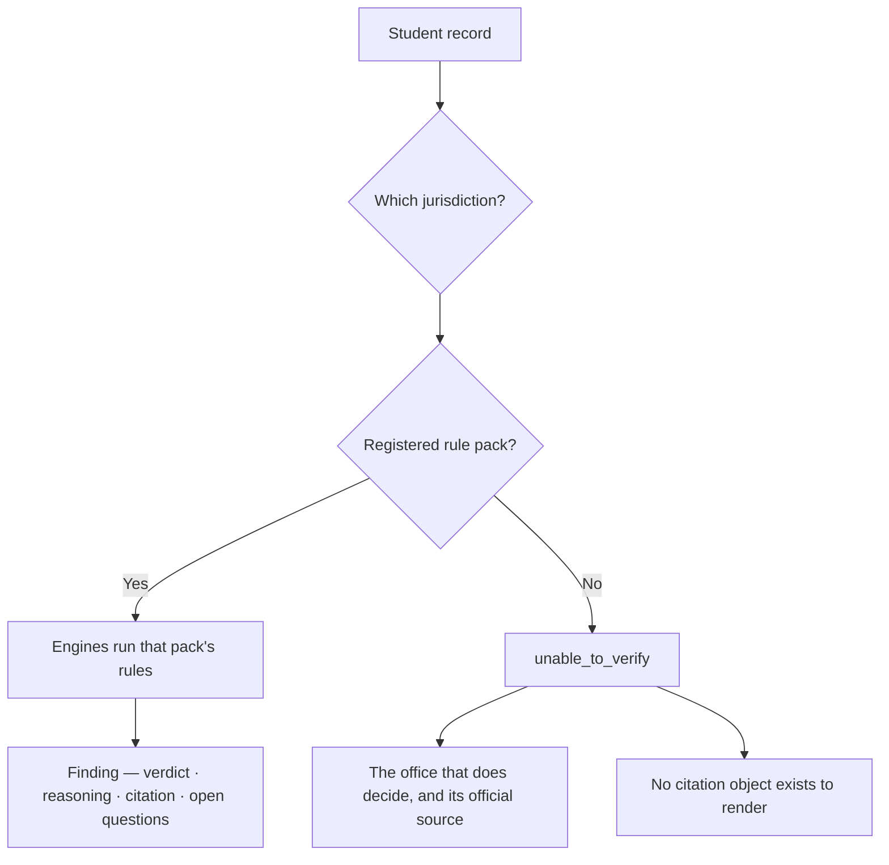

# PathWise

**An international student's future is decided by three offices that never speak to each other — the
DSO who reports to immigration, the domicile officer who sets tuition, and the financial aid office.
Each sees one slice. None sees the student. So one fact closes several doors at once, and nobody
notices until it is expensive.**

**Live demo → https://path-wise-amber.vercel.app**

Stellic Pathfinders Challenge 2026.

---

## What PathWise does

It holds the student as a single timeline and runs eleven rule engines over it, so a fact entered
once is read by every office at once.

In Virginia, F-1 status blocks in-state domicile under the SCHEV Domicile Guidelines and, separately,
blocks state financial aid. Same fact, two offices, neither aware of the other. PathWise shows both
consequences on one screen, each with the rule quoted, the section cited, and the office that
actually decides — which is never PathWise.

Every finding carries four things:

1. **What the rule says** — quoted, with its citation and the date the source was last verified.
2. **Who decides it** — the domicile officer, the financial aid office, the DSO. Not us.
3. **What PathWise could not establish** — as explicit open questions, not silence.
4. **What evidence would resolve it.**

## "Unable to verify" is a result, not an error

This is the part worth arguing about, so it is stated plainly:

> **Unknown must never become yes. Unknown must never become no.**

A rule PathWise has not read does not become permission, and it does not become a bar either. Select
an immigration status Virginia's pack was never authored against and PathWise will tell you it cannot
answer, name the office that can, and say — in as many words — that this is *not* a finding that the
status is barred.

The same discipline runs through the engines. A CPT record that could honestly be read two ways is
shown both ways rather than resolved by guessing: the demo student's ledger reads 342 days or 552
days depending on one missing I-20, and PathWise refuses to choose until the document arrives.

### How the refusal is enforced



The refusal is a property of the types, not a message the interface remembers to show.

`resolveJurisdiction` returns a context whose `packs` and `display` fields are **present iff**
PathWise has modelled that jurisdiction — the declaration is in `lib/engines/jurisdiction.ts`, and
the comment on `display` reads *"Present iff `packs` is — there is nothing to cite otherwise."* So
when no pack is registered, `residencyFindingFor` does not run a weakened version of the engines; it
routes to `unmodelledResidencyFinding` instead, and a screen that tries to print a citation has
**nothing to print rather than something borrowed**. Showing another state's statute under this
state's heading is not a bug that was fixed — it is unrepresentable.

Coverage follows the same rule. A jurisdiction's level on `/coverage` is derived from what its
registered pack *declares it can answer* (`lib/jurisdiction-coverage.ts`), and `lib/rulepacks/validate.ts`
rejects a pack that declares `modelled` while omitting the rules that word implies — a residency pack
claiming it with no gate, no intent factors, or a gate without a status classification fails the
schema test. **You cannot make the map say "modelled" by editing the map.** You can only make it say
that by authoring a pack that survives the check.

## The eleven engines

| Engine | Answers |
|---|---|
| `cpt-ledger` | Full-time CPT days per education level, including days created only by overlapping part-time authorizations |
| `opt-budget` | OPT months used and remaining, per level |
| `unemployment-clock` | Days against the post-completion unemployment cap |
| `domicile-gate` | Whether a status can hold domicile at all, before anything else is asked |
| `domicile-clock` | The durational requirement, counted from the rule the jurisdiction actually states |
| `domicile` | The full determination — dependency, intent factors, rules of construction |
| `aid-eligibility` | Which aid form applies, state provisions, and the earliest binding deadline |
| `consequence-engine` | What one life event changes across every domain at once |
| `next-steps` | What is actionable now, and what is waiting on a document |
| `jurisdiction` | Which state's rules apply — the only place that question is answered |
| `unmodelled-jurisdiction` | What to say honestly about a state PathWise has not read |

Every regulatory value — the 365-day CPT cliff, the 90-day unemployment cap, Virginia's one-year
clock — lives in a versioned rule pack carrying its authority, source URL and verification date. No
regulatory threshold is typed into the engine code.

## Coverage — stated honestly

51 jurisdictions are in the coverage model. They are **not** equally covered:

| | Count | What that means |
|---|---|---|
| Modelled in full | **1** | Virginia — status gate, durational clock, dependency, intent factors, aid |
| Partially modelled | **2** | Texas, Tennessee — residency read, with the unread parts declared as open questions |
| Source captured only | **43** | The deciding body and its published rule are recorded; no rules are applied |
| Source not verified | **5** | PathWise could not verify an official source, and says so |

PathWise does not model all fifty states in depth and does not claim to. For an unmodelled state it
returns "unable to verify", names the office that decides, and links the official source where one
has been verified — rather than running Virginia's rules under another state's heading.

## Privacy

- Runs entirely in the browser tab. No account, no sign-in.
- **No server-side student record.** Nothing you enter is transmitted anywhere.
- No cookies, no `localStorage`, no `sessionStorage`, no IndexedDB.
- No analytics, no tracking pixels, no third-party hosts — the production build makes zero
  cross-origin requests.
- Closing the tab is the delete button. There is nothing else to delete.

## No language model

There is no LLM anywhere in PathWise, and no network call to one. Findings are computed by
deterministic rule engines over versioned rule packs, so the same record always yields the same
answer with the same citation. The runtime dependency list is exactly three packages: `next`,
`react`, `react-dom`.

---

## Run it

```bash
cd pathwise-app
npm ci          # reproducible install from the committed lockfile
npm run dev     # http://localhost:3000
```

## Test it

```bash
npm test        # full suite: pack schema, source URLs, evidence flow, jurisdiction routing, golden fixtures
npm run typecheck
npm run lint
```

The suite includes adversarial batteries that fire malformed, contradictory and hostile input at the
engines and assert that none of it becomes a confident answer.

```bash
npm run check:sources   # resolves every source URL the packs cite (needs network; not part of npm test)
```

## Build

```bash
npm run build   # every route is prerendered as static content
```

## Verification

Every row below was produced by running the command in this repository at the current commit.

| Gate | Command | Result |
|---|---|---|
| Tests | `npm test` | **456 assertions, 0 failures** across 6 suites |
| Types | `npm run typecheck` | clean |
| Lint | `npm run lint` | clean — no ESLint warnings or errors |
| Build | `npm run build` | compiled; **17/17 routes prerendered** as static content |
| Sources | `npm run check:sources` | **55 cited URLs resolved, 0 dead** |

Checked separately against the deployed build in a real browser:

- **120 page loads** across 10 viewports (320×568 → 1920×1080) × 12 routes — **0 horizontal
  overflow, 0 console errors**, one `<h1>` per route, every form control labelled.
- **All 51 jurisdictions** submitted through `/check` and inspected for a borrowed authority —
  **0 citation leaks**. No state's result region carried another state's statute.
- **0 network requests after form submission**, and `localStorage`, `sessionStorage`, cookies and
  IndexedDB all empty. The only non-first-party URL loaded anywhere is a `data:` icon.

The test suite includes adversarial batteries that fire malformed, contradictory and hostile input
at the engines and assert that none of it becomes a confident answer, plus a golden fixture that
pins six Virginia findings byte-for-byte so a refactor cannot quietly change a verdict.

---

## Repository layout

| Directory | What it is |
|---|---|
| `pathwise-app/` | **The application.** Engines in `lib/engines/`, rule packs in `lib/rulepacks/`, tests in `lib/test/` |
| `pathwise-core/` | Archived recovery blueprint and design docs. **Not runtime** — its rule packs are a stale snapshot and are marked as such |
| `AUDIT/`, `STORY-AUDIT/`, `visual-audit/` | Adversarial test scripts and audit records kept as evidence of how the release was checked |

## Limitations

- One jurisdiction is modelled in full. Two more are partial. The rest carry a source, not a ruling.
- Rule packs are verified as of the dates they carry. Rules change; the packs say when they were last
  read, and a pack under litigation says so.
- The demo student is fictional. PathWise has no real user data, and has never had any.
- PathWise reads the *file* a student attaches — its size, type and hash — not the words inside it.
  It cannot tell what a document says and does not pretend to.

## This is not legal advice

PathWise does not decide anything. It reads published rules and shows what they appear to say about a
record, together with what it could not establish. **The domicile officer, the financial aid office
and the DSO are the deciding authorities**, and their determination is the one that counts. Nothing
here is legal advice, an immigration filing, or a substitute for your institution's own
determination. Confirm anything that matters with the office named on the finding.
